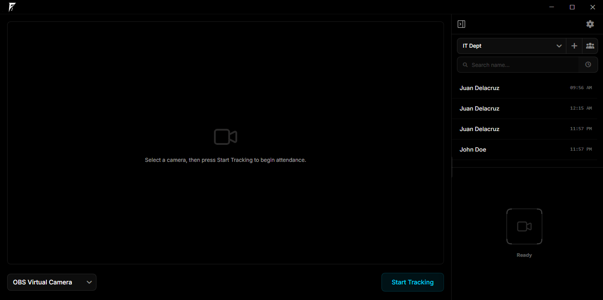
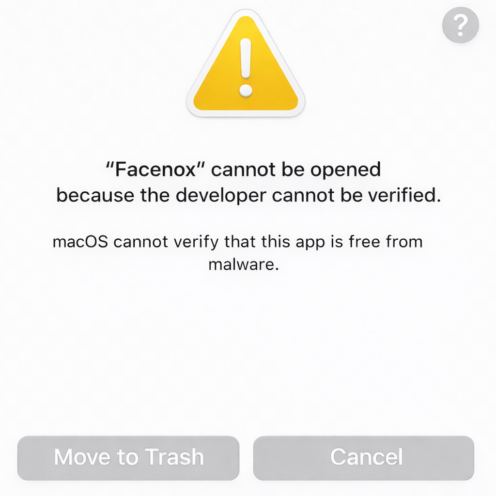

<a id="readme-top"></a>

> [!CAUTION]
> This is the official open source repository for Facenox. Treat other repositories, installers, and downloads as unverified unless they come from the official Facenox channels.

<a href="https://github.com/facenox/facenox">
  
</a>

<div align="center">

[![Contributors][contributors-shield]][contributors-url]
[![Forks][forks-shield]][forks-url]
[![Stargazers][stars-shield]][stars-url]
[![Issues][issues-shield]][issues-url]
[![AGPL License][license-shield]][license-url]

</div>

Facenox is an offline-first face recognition system that performs real-time face detection, ByteTrack-based face tracking over detector outputs, recognition, and liveness checks locally. No cloud required.

Built for privacy-conscious teams, it keeps biometric matching local while optionally syncing attendance data to a management dashboard.

Facenox is built on a simple idea: you should own your biometric data.

This repository contains the open source Facenox desktop app and local backend. Facenox Management Dashboard is an optional separate hosted companion service and is not included in this repository.

Ideal for teams, schools, and organizations that need reliable attendance without relying on cloud-based biometrics.

<div align="center">
  
</div>

## Key Highlights

- Real-time face recognition, CPU-friendly, no GPU required
- Fully local biometric matching by default
- Works fully offline. No internet required for core workflows
- Optional management dashboard for centralized reporting and sync

## Why Facenox

Most face recognition attendance systems rely on cloud-based biometrics. Facenox doesn't. Biometric matching stays local on the desktop.

| Local-first                                     | Offline-ready                                            | Consent-aware                                      | Encrypted                                                                                                                  |
| ----------------------------------------------- | -------------------------------------------------------- | -------------------------------------------------- | -------------------------------------------------------------------------------------------------------------------------- |
| Recognition and attendance stay on the desktop. | Core attendance workflows keep working without internet. | Enrollment and matching respect biometric consent. | Biometric templates are encrypted locally, and moving them between devices requires encrypted backup and restore. |

## Features

- Local face detection, recognition, and anti-spoofing
- Group and member management
- Attendance records, sessions, and exports
- Consent-aware biometric enrollment and deletion
- Encrypted local biometric storage
- Password-protected `.facenox` backup and restore
- Optional Management Dashboard Beta pairing with manual and background sync

## Performance

- Real-time recognition on CPU (no GPU required)
- Tested on low-spec hardware (e.g., older laptops)
- Optimized for low-latency inference
- Designed for real-world environments with varying lighting and hardware conditions

## Management Dashboard Beta

Facenox Management Dashboard is an optional companion service for:

- centralized reporting
- device pairing
- sync monitoring
- organization and site-level visibility

Facenox Management Dashboard is separate from this open source desktop repository. The desktop app in this repo remains usable without the hosted dashboard service.

The desktop app pushes attendance snapshots to the dashboard. Management Dashboard Beta does not upload raw face images or face embeddings, and biometric matching stays local. To move biometric profiles between devices, use encrypted backup and restore.

## Offline-First Behavior

Facenox Desktop continues to work locally when internet access is unavailable:

- recognition still works
- attendance is still recorded locally
- local settings and backup operations still work

Dashboard pairing, Remote Sync, and management dashboard updates resume when connectivity returns.

## Roadmap

- [ ] Management dashboard for centralized reporting and analytics
- [ ] macOS and Linux installer support
- [ ] Code signing and notarization
- [ ] Multi-device sync support
- [ ] Mobile companion app

## Download

[](https://github.com/facenox/facenox/releases/latest)

Prebuilt binaries are currently published for Windows. If you are on macOS or Linux, build from source using [docs/INSTALLATION.md](docs/INSTALLATION.md).

Official release and trust rules are documented in [docs/CODE_SIGNING_POLICY.md](docs/CODE_SIGNING_POLICY.md).

### Installation Notes

Facenox is still early-stage software. Desktop installers may trigger OS trust prompts until code-signing and notarization are in place.

#### Windows SmartScreen

If Windows shows the SmartScreen warning:

1. Select **More info**.
2. Select **Run anyway**.


#### macOS Gatekeeper

If macOS blocks the app because the developer is unidentified:

1. Right-click the downloaded app or disk image.
2. Select **Open**.
3. Confirm the prompt.



## Documentation

- [docs/FEATURES.md](docs/FEATURES.md): features, Management Dashboard Beta scope, and out-of-scope items
- [docs/ARCHITECTURE.md](docs/ARCHITECTURE.md): desktop architecture and Remote Sync boundaries
- [docs/INSTALLATION.md](docs/INSTALLATION.md): local development and desktop build setup
- [docs/CODE_SIGNING_POLICY.md](docs/CODE_SIGNING_POLICY.md): official release identity, trust rules, and current signing status
- [docs/TROUBLESHOOTING.md](docs/TROUBLESHOOTING.md): common setup and runtime issues
- [docs/PRIVACY.md](docs/PRIVACY.md): data handling, consent, backups, and Remote Sync boundaries
- [SECURITY.md](SECURITY.md): supported version policy and vulnerability reporting
- [app/TESTING.md](app/TESTING.md): frontend and Electron app testing conventions

## Tech Stack

### Desktop

- Electron
- React 19
- TypeScript
- Vite
- Tailwind CSS

### Local backend

- Python 3.10+
- FastAPI
- ONNX Runtime
- OpenCV
- SQLAlchemy
- Alembic
- SQLite

## Development

See [docs/INSTALLATION.md](docs/INSTALLATION.md) for the full setup flow.

Quick start:

```bash
git clone https://github.com/facenox/facenox.git
cd facenox
cd server
python -m venv venv
venv\Scripts\activate
pip install -r requirements.txt

# Optional: development tools
# pip install -r requirements-dev.txt

# Optional: backend packaging/build tools
# pip install -r requirements-build.txt
cd ..
cd app
pnpm install
cd ..
pnpm dev
```

## Contributing

Pull requests are welcome. Read [CONTRIBUTING.md](CONTRIBUTING.md) before opening a PR, especially if you touch privacy, sync, biometrics, or storage behavior.

## License

Facenox is licensed under the GNU AGPL v3. See [LICENSE](LICENSE).

Third-party notices live in [THIRD_PARTY_LICENSES.md](THIRD_PARTY_LICENSES.md).

## Acknowledgments

- [FastAPI](https://fastapi.tiangolo.com/)
- [ONNX Runtime](https://onnxruntime.ai/)
- [Electron](https://www.electronjs.org/)
- [React](https://react.dev/)
- [OpenCV](https://opencv.org/)

[contributors-shield]: https://img.shields.io/github/contributors/facenox/facenox.svg?style=for-the-badge&color=000000&v=1
[contributors-url]: https://github.com/facenox/facenox/graphs/contributors
[forks-shield]: https://img.shields.io/github/forks/facenox/facenox.svg?style=for-the-badge&color=000000&v=1
[forks-url]: https://github.com/facenox/facenox/network/members
[stars-shield]: https://img.shields.io/github/stars/facenox/facenox.svg?style=for-the-badge&color=000000&v=1
[stars-url]: https://github.com/facenox/facenox/stargazers
[issues-shield]: https://img.shields.io/github/issues/facenox/facenox.svg?style=for-the-badge&color=000000&v=1
[issues-url]: https://github.com/facenox/facenox/issues
[license-shield]: https://img.shields.io/github/license/facenox/facenox.svg?style=for-the-badge&color=000000&v=1
[license-url]: LICENSE
