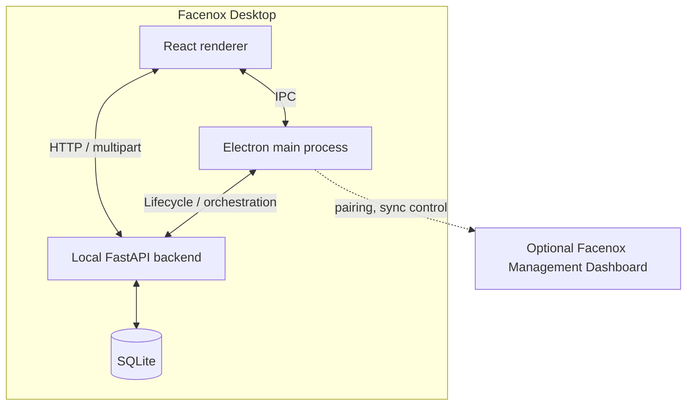

# Architecture

Facenox is a desktop-first system. Recognition, attendance, and biometric storage run on the local machine.

## Deployment Model

- Primary runtime: desktop app
- Primary database: local SQLite
- Network requirement for core attendance: none
- Biometric processing: local only
- Optional remote integration: separate Facenox Management Dashboard deployment for reporting and device management

## High-Level Components

## Desktop Responsibilities

### React renderer

- camera and attendance UI
- member and group management
- settings, reports, and backup flows
- Management Dashboard Beta configuration UI

### Electron main process

- app lifecycle
- backend startup and health monitoring
- local settings persistence
- update checks
- Management Dashboard Beta pairing and sync orchestration

### Local FastAPI backend

- face detection and recognition endpoints
- anti-spoofing and attendance APIs
- export and import endpoints for backups and Remote Sync
- local database access

### Local SQLite database

- groups and members
- attendance records and sessions
- consent metadata
- encrypted biometric templates
- audit and settings data

## Data Flow

### Desktop-only flow

1. The renderer captures camera frames and attendance input.
2. The renderer sends binary image data to the local FastAPI backend.
3. The backend runs detection, anti-spoofing, and recognition locally.
4. The backend writes results to the local SQLite database.

This path does not require internet access.

### Management Dashboard Beta flow

1. An admin generates a pairing code in Facenox Management Dashboard.
2. The desktop app stores the Remote Sync URL and redeems the pairing code.
3. The desktop receives an organization ID, site ID, device ID, and device token.
4. The desktop exports a local attendance snapshot.
5. The Electron sync manager wraps that export in a Remote Sync envelope and sends it to `POST /api/sync/push`.

The desktop remains the system of record for biometrics and local attendance capture.

## Desktop and Remote Sync Boundary

The Remote Sync boundary is intentionally narrow.

### Data that stays local

- raw face images
- biometric templates and embeddings
- local face matching
- local enrollment workflow

### Data that may be sent to Facenox Management Dashboard

- organization, site, and device identifiers
- group and member directory data needed for reporting
- attendance records and sessions
- sync status and device health metadata

## Sync Model

The current sync design is intentionally simple.

- one-way only: desktop to dashboard
- snapshot-based instead of event-stream based
- auto-sync available in the desktop app
- manual `Sync Now` available as an override
- initial sync runs immediately after pairing
- catch-up sync runs on startup when the device is overdue

If Remote Sync fails, local attendance continues.

## Not in This Repository

This repository does not implement:

- Remote-side biometric storage
- Remote-side face matching
- two-way sync for members or attendance edits
- payroll or HRIS integrations
- mobile clients

Those concerns belong to a separate Remote Sync architecture and should be documented there directly.
