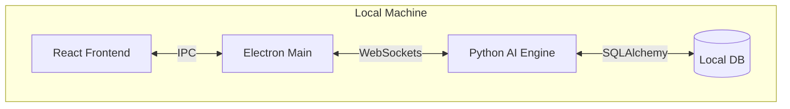

# System Architecture

Suri is currently a **local-first desktop application**. The implemented system in this repository runs face processing, storage, and attendance logic on the local machine.

## Current Architecture

## Core Components

### 1. Local Processing Layer
-   **Electron renderer** provides the desktop UI.
-   **Electron main** handles local orchestration, IPC, and app lifecycle.
-   **FastAPI backend** exposes localhost-only endpoints for attendance, consent, vault import/export, and biometric operations.
-   **ONNX-based recognition pipeline** runs on the local machine.

### 2. Local Data Flow
The implemented data flow is local:
1.  **Electron UI** handles user actions and local app orchestration.
2.  **FastAPI backend** handles attendance, consent, vault import/export, and biometric operations over localhost.
3.  **SQLite** stores attendance data, member records, settings, audit entries, and encrypted biometric templates on the device.

### 3. Current Deployment Model
-   **Primary deployment**: single desktop app installation.
-   **System of record**: local SQLite database.
-   **Network dependency**: none for core attendance and recognition workflows.
-   **Biometric processing**: local only in the current implementation.

### 4. Proposed Future Web Dashboard
The project may later add a web dashboard or hosted reporting layer. If that happens, it should be treated as a separate architecture from the current desktop system.

The intended boundary should be:
-   **Desktop app remains the biometric engine**.
-   **Hosted dashboard handles reporting, administration, and sync orchestration**.
-   **Cloud services should not be described as current functionality until implemented and documented**.
-   **Any future networked design should document what data leaves the device, what remains local, and how consent, retention, and deletion are enforced across both systems**.

## Tech Stack (Updated)

### Frontend
-   **Framework**: React 19 + Vite
-   **Style**: Tailwind CSS v4
-   **Runtime**: Electron

### Backend (Local)
-   **Language**: Python 3.10+
-   **API**: FastAPI (Localhost only)
-   **AI**: ONNX Runtime (CPU/GPU)

### Notes
-   **Biometric templates are encrypted at rest locally**.
-   **Vault backups are password-encrypted before being written to disk**.
-   **The current repository should not be read as promising a deployed cloud biometric service**.
